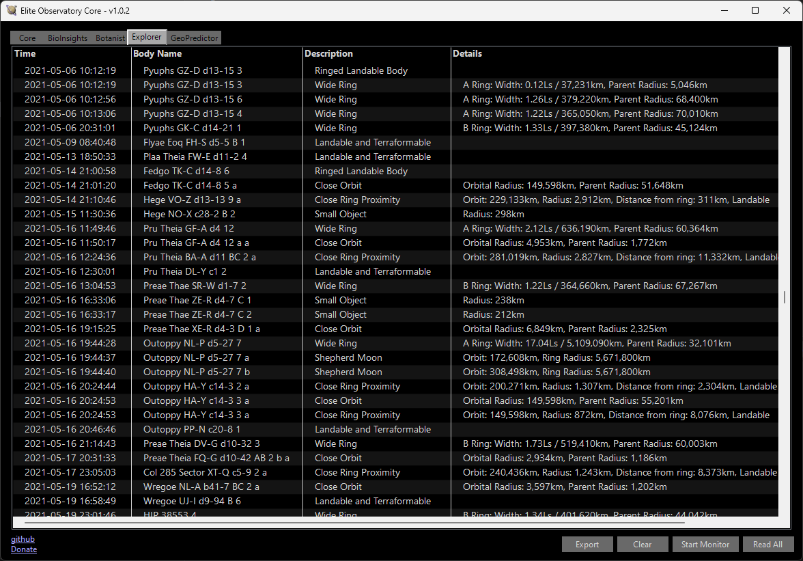

# Explorer

Explorer is a core [plugin](/plugins) for the Observatory, designed to point out any astronomical points of interest that might be encountered.

Anything discovered by Explorer can configurably produce [notifications](/notifications).

## Installation

  * Explorer comes pre-installed with Observatory Core by default.
  * If manual installation is required, create a 'plugins' folder in the same place as Observatory Core.exe. Add ObservatoryExplorer.dll to this folder.
  * When starting Observatory, if successful, there should be an Explorer tab on the left.

## Usage

import Image from 'next/image'

*Example output from Explorer.*

Explorer divides its output information into subsections:

  * **Time:** The precise date and time of discovery of the object.
  * **Body Name:** The name of the relevant astronomical body.
  * **Description:** A brief description of what features of the object are notable.
  * **Details:** More precise details of what features are notable (e.g. thin atmospheres, wide rings, non-locked bodies).

## Customisation

Explorer features a wide range of customisation capabilities. In addition to its standard configuration (found in the Observatory Explorer dropdown menu in the Core tab), it is possible to specify [custom criteria](/explorer/customcriteria) for Observatory to notify you of.

The options available to select in standard Explorer's configuration are usually self-explanatory, but some of the more complex ones are listed below:

  * **Nested Moon:** A moon orbiting a moon. Also known as a [subsatellite](https://en.wikipedia.org/wiki/Subsatellite).
  * **[Shepherd moon](https://en.wikipedia.org/wiki/Shepherd_moon):** A moon found in the rings of its parent planet, 'shepherding' the asteroids and dust around it.
  * **Good FSD Injection:** This will trigger upon finding a body with 5 of the necessary materials for a premium FSD injection. 
    * Note: you need 6 different materials for premium injections, but only 5 can be found on any one body at a time.
  * **High Eccentricity:** Triggers upon finding a body with a highly eccentric orbit (i.e. one that deviates from a perfect circle or ellipse).
  * **Colliding Binary:** Triggers if the orbits of two planets collide.
