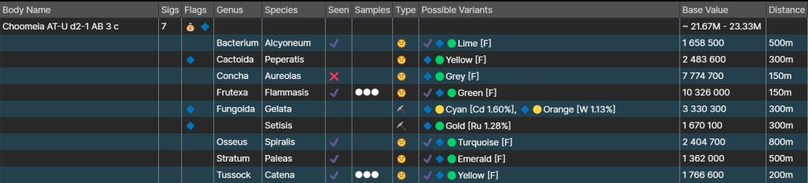

# BioInsights

BioInsights is an optional plugin for the Observatory, designed to aid cataloguing the biological signals found in Elite Dangerous.

## Features

  * Detection of biological signals in a given system upon FSS scan
  * Prediction of likely signals based on specific system/body features
  * Simple and intuitive categorisation and logging of scanned biologicals

## Installation

  * Make sure you already have Elite Observatory [downloaded](/release).
  * Navigate to https://edjp.colacube.net/observatory and download BioInsights.
  * Double-click on the downloaded .eop file to install it into Observatory.
    * If installation was successful, Observatory will now have an additional BioInsights tab.
  * Perform a "Read All" by clicking the appropriate button. This will allow the plugin to read all of your historical journals and update its databases as necessary- **this is important for accurate reporting of undiscovered signals!**
  * BioInsights is now ready to use.

## Usage

import Image from 'next/image'

*An example of a body mapped by BioInsights.*

Like [Botanist](/plugins/botanist), BioInsights divides its output into several subsections:

  * **Body Name:** The name of the mapped body, which can be located in-game in your External Interface Panel or the System Map.
  * **Sigs:** The number of biological signatures on the planet.
    * This value should always be accurate and does not change upon DSSing the body.
  * **Flags:** Any noteworthy information about the body or its signatures will be displayed here, for example if the body has high biological value or contains a new codex entry.
  * **Genus:** Refers to the type of biological present upon the planet.
  * **Species:** Refers to the specific subcategory of the biological.
  * **Seen:** Indicates whether you have seen the specific signature yet. By default this box will be **blank** if unseen, and **ticked** if seen.
    * A signature is 'seen' when it has been scanned by either the Composition Scanner on a ship or the Genetic Sampler on foot.
    * The signatures in the Genus and Species categories are **predictions** based on the characteristics of the body and the star it orbits. If a given signature is not present on the planet, it will show up with a **cross** in the Seen box after DSSing the body (e.g. Concha Aureolas in the above image).
  * **Samples:** Indicates whether samples have been taken with the Genetic Sampler. This box will be blank until the first sample is taken, at which point the indicator will appear.
  * **Type:** Indicates whether the biological variant(s) are determined by star class or planetary material.
  * **Possible Variants:** All of the possible colour variants of the biological species. The specific star or material responsible for each variant will be displayed in square brackets [ ] after the colour.
  * **Base Value:** The value in credits of each biological. This does **not** account for first discovery bonuses.
    * The overall value of the body is calculated at the top of the page.
  * ** Distance:** The distance you have to travel before being able to scan a new sample of the biological.
    * This is referred to as the 'Clonal Colony Range' in the in-game Codex.

As BioInsights is predicting biologicals based on characteristics and some species can appear under similar conditions to each other, it will often be the case that a particular genus/species/variant does **not** appear on the planet. If a particular variant is not present it will be marked with a **cross** as soon as it is confirmed not to exist.
  * The **genus** of a particular body are determined as soon as the body is DSSed (e.g. Concha does not exist in any form on the example body).
  * The **species** of a particular genus is determined only when the relevant species has been found and scanned. Only one species of a given genus can exist per planet (e.g. the Fungoida in the example will be either Gelata or Setisis, but cannot be both).
  * The **variant** of a particular species is determined at the same time as the species is: i.e. when found and scanned (e.g. if the species in the example is Fungoida Gelata, then the colour could be either Cyan or Orange).
  * The **total value** of the body will appear as a range of all possible genus/species, and will refine itself as each signature is scanned (e.g. as the Fungoida species is not known in the example, the value of the body is not precise).

BioInsights is able to **mark** entries, by default with a blue diamond 🔷. If enabled, any biological your CMDR has not scanned before will be marked. If a marked biological is scanned, its mark will be removed. 
  * You can configure which biologicals you want marked in the settings of BioInsights (in the Core section of Observatory).
