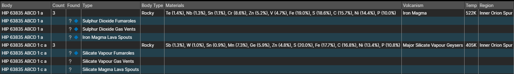

# GeoPredictor

GeoPredictor is an optional [plugin](/plugins) for the Observatory, designed to detect and report planetary geological signals.

## Installation

  * Make sure you already have Observatory [downloaded](/release).
  * Navigate to [GeoPredictor's Github Releases Page](https://github.com/mcmuttons/GeoPredictor/releases) and download GeoPredictor.
  * Double-click on the downloaded .eop file to install it into Observatory.
  * Perform a "Read All" by clicking the appropriate button. **This is required on first run for the plugin to function!**
  * GeoPredictor is now ready to use.

## Usage

import Image from 'next/image'

*An example output from GeoPredictor.*

As with other plugins, GeoPredictor divides its output into subsections:

  * **Body:** The relevant body containing the geological signals.
  * **Count:** The amount of geological signals on the body.
  * **Found:** Displays a symbol depending on the status of the signal.
    * ❔ if the signal has been predicted but unconfirmed
    * ✔️ if the signal has been predicted and confirmed
    * 🔷 if the signal is unconfirmed and might be a new codex entry
    * ❌ if the signal is unpredicted (unexpected behaviour)
  * **Type:** The type of geological signal.
  * **Body Type:** The type of body containing the signal.
  * **Materials:** Displays the materials (and their percentage) that compose the body.
  * **Volcanism:** The volcanism of the body, as per the System Map
  * **Temp:** The temperature of the body.
  * **Region:** The region in which the body lies.

Further information on settings and configuration can be found on [the plugin's github page](https://github.com/mcmuttons/GeoPredictor).
